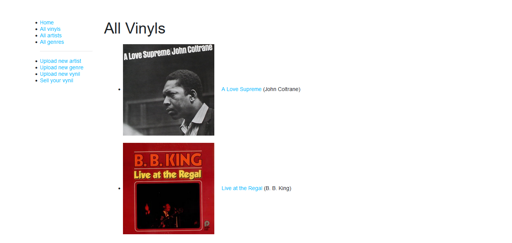

## About The Project



This is a project based on a vinyl "inventory", where the user can look and upload vinyls. I had the idea to make this project to learn CRUD web-apps, and I used the vinyl theme because it includes many "sections": the Vinyl, the Vinyl Issue, the Artist, the Genre etc; in that sense, I used a lot of database relations. 

In this web application, we can:

* Create, Read, Update and Delete Artist.
* Create, Read, Update and Delete Vinyls.
* Create, Read, Update and Delete musical Genres.
* Create, Read, Update and Delete Issues.
* Log In and Register with an account.

## Built With

This project was built using:

* 
* 
* 
* 
* 
* 

## Getting Started

Here's how to run this project locally

### Prerequisites 

First, you should have Node, Git (if you use Linux, it's already installed.) and an Atlas dabatase set up.
[Get Node here.](https://nodejs.org/en)
[Get Git here](https://git-scm.com/).
[Atlas MongoDB](https://www.mongodb.com/atlas/database)

### Installation 

Clone the repo

   ```sh
   git clone https://github.com/stpafk/vynil-inventory
   ```

Install NPM packages

  ```sh
   npm install 
   ```

Create a .env file with a variable called MONGO like this:

 ```sh
    MONGO = "mongodb+srv://<username>:<password>@<cluster>.<key>.mongodb.net/?retryWrites=true&w=majority"
 ```
 
Run the application>

```sh
    npm run dev
```

## Contact

Twitter: [https://twitter.com/dubsteph4n](https://twitter.com/dubsteph4n)
Project Link: [https://github.com/stpafk/vynil-inventory](https://github.com/stpafk/vynil-inventory)